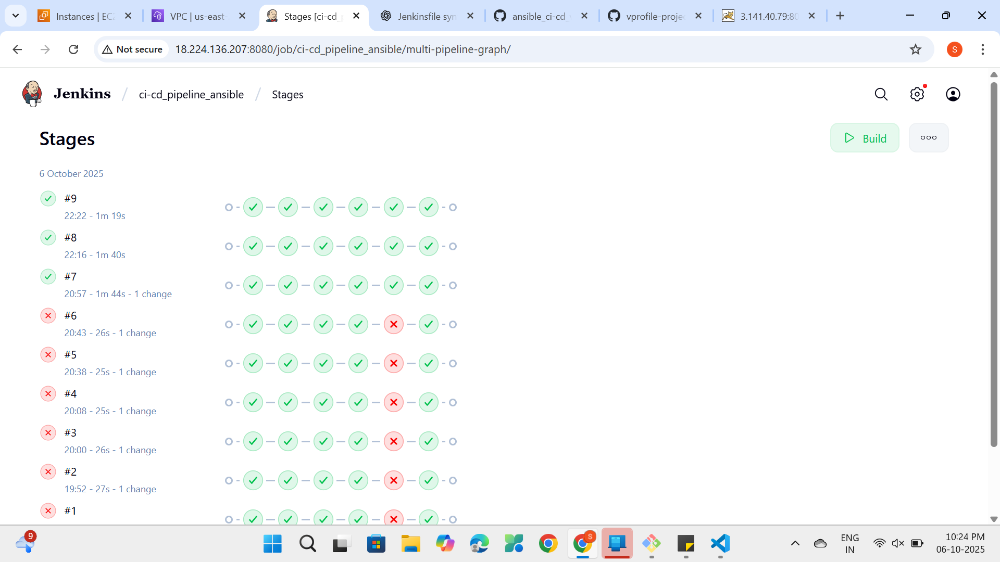

# vProfile – Multi-Tier Application Deployment with Jenkins & Ansible

This project demonstrates automated deployment of a **multi-tier Java web application** using a **Jenkins scripted pipeline** and **Ansible playbooks**.  
The pipeline integrates build, configuration management, and deployment into a single CI/CD process.

---

## 🏗 Architecture

| Tier | Components | Description |
|------|------------|-------------|
| **Controller** | Ansible | Orchestrates provisioning & deployments |
| **Frontend + Backend** | Java (Spring MVC) on Tomcat | Handles UI & business logic |
| **Cache + Messaging** | Memcached, RabbitMQ | Improves performance & async communication |
| **Database** | MySQL | Persistent storage layer |

---

## ⚙️ Tech Stack

- **App Framework**: Java, Spring MVC, JSP  
- **Build Tool**: Maven (packaging WAR)  
- **Database**: MySQL  
- **Cache & Messaging**: Memcached, RabbitMQ  
- **Automation**: Ansible (playbooks, roles)  
- **CI/CD**: Jenkins (scripted pipeline)  
- **Version Control**: GitHub  

---

## 🚀 Jenkins CI/CD Pipeline

The pipeline (`Jenkinsfile`) defines the full automation process:

### Pipeline Stages
1. **Clone Repository**  
   - Pulls source code from GitHub (`main` branch).  

2. **Build with Maven**  
   - Cleans & compiles project.  
   - Packages application into a `.war` file.  
   - Skips tests for faster deployment (`mvn clean package -DskipTests`).  

3. **Run Ansible Playbooks**  
   - Executes `ansible/site.yaml` using inventory file.  
   - Provisions target servers and deploys the WAR.  
   - Uses Jenkins-managed SSH key for authentication.  

### Post Actions
- ✅ **Success** → Logs "Deployment completed successfully!"  
- ❌ **Failure** → Logs error with troubleshooting hints.  

---

## 📂 Repo Structure

```
ansible_ci-cd_vprofile/
├── ansible/
│ ├── inventory # Server inventory
│ ├── site.yaml # Main Ansible playbook
│ └── roles/ # Roles for app, DB, cache, messaging
├── src/ # Java application source
├── Jenkinsfile # CI/CD pipeline definition
├── pom.xml # Maven build config
└── README.md
```

---

## 🌟 Key Features

- End-to-end **CI/CD automation** with Jenkins scripted pipeline.  
- **Infrastructure as Code**: Server setup & configuration automated via Ansible.  
- **Multi-tier architecture**: Frontend, backend, cache/messaging, database deployed on separate servers.  
- **Secure deployment** using private SSH keys managed in Jenkins.  
- Modular design → easy to extend with monitoring, scaling, or containerization.  

---

## 🔮 Future Enhancements

- Add **SonarQube stage** for code quality checks.  
- Store build artifacts in **Nexus/Artifactory**.  
- Containerize services with **Docker/Kubernetes**.  
- Add **Prometheus + Grafana** for monitoring.  
- Use **Vault/SSM** for secrets management.  

## 📸 Screenshots

### Jenkins Pipeline Success


### Application Running

.png)
.png)
